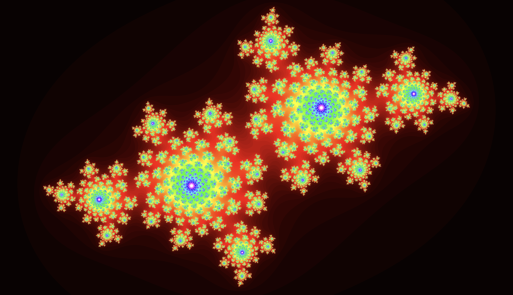

# Real-time Julia Set Renderer
A simple fractal renderer built with Rust, WASM, and WebGPU. A WGSL shader renders the fractal in real-time for your viewing pleasure. Check it out via GitHub Pages [here](https://kewlkris.github.io/fractals/)!



## Building
To build this project, you need to have Rust, wasm-pack, and NodeJS installed. After that, everything can be built with a single command:
```
npm run build
```
In order to keep the GitHub Pages integration simple, the webpage build directory is the repository's root folder, and the project's source code is located in [/src](/src).
